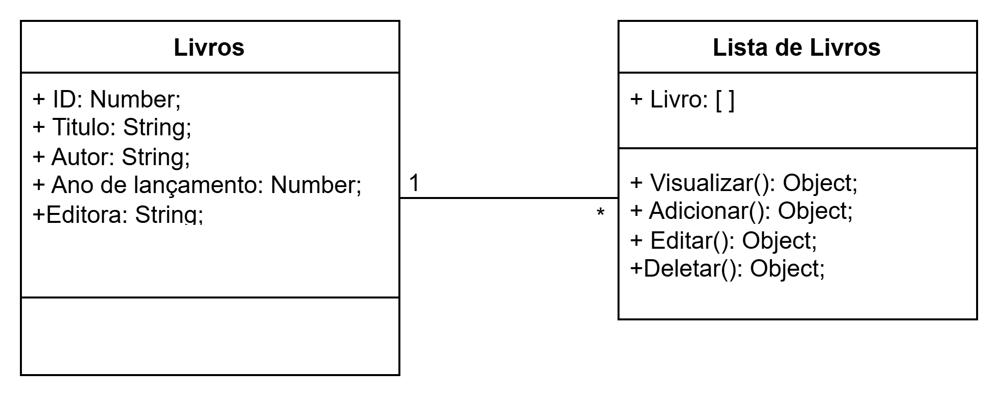

# BOOKS API

A imagem representa um diagrama de classes simplificado para um sistema de gerenciamento de livros. Ele ilustra duas classes principais: Livro e "Lista de Livros", juntamente com seus atributos e métodos. Este diagrama é uma representação conceitual de como os dados e funcionalidades podem ser organizados em um sistema de software.

## Classe: Livro

### Atributos:
ID: Number (Identificador único do livro),
Título: String (Título do livro),
Autor: String (Nome do autor),
Ano de lançamento: Number (Ano de publicação),
Editora: String (Nome da editora),

### Métodos:
Nenhum método específico é listado.

## Classe: Lista de Livros

### Atributos:
Livro: [ ] (Uma lista ou array contendo objetos da classe "Livro")

### Métodos:
Visualizar( ): Object (Provavelmente para exibir detalhes de um livro),
Adicionar( ): Object (Para adicionar um novo livro à lista),
Editar( ): Object (Para modificar os dados de um livro existente),
Deletar( ): Object (Para remover um livro da lista),

### Relacionamento:

Existe uma seta unidirecional da classe "Livro" para a classe "Lista de Livros", indicando que a "Lista de Livros" contém instâncias da classe "Livro". O asterisco (*) próximo à seta sugere uma multiplicidade de "muitos", indicando que uma "Lista de Livros" pode conter múltiplos objetos "Livro".

